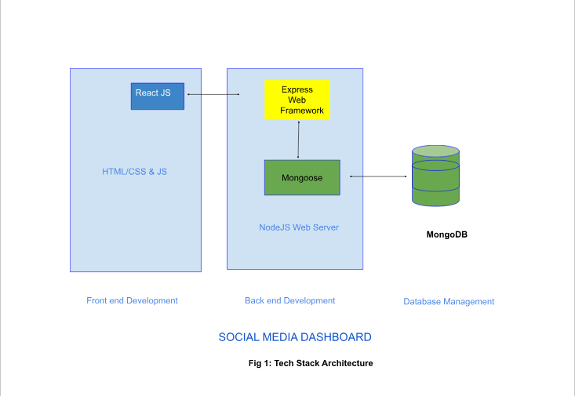

# Social Media Dashboard

> **NOTE**: 25-10-2024

> This project is a work in progress. While the backend is fully functional, the frontend is still being developed. Contributions and feedback are welcome!

---

## Project Overview

A full-stack social media dashboard application that allows users to post updates, follow others, and interact through likes and comments. This project is built with a React frontend and a Node.js backend.

## Table of Contents

- [Frontend](#frontend)
- [Backend](#backend)
- [Features](#features)
- [Tech Stack](#tech-stack)
- [Installation](#installation)
- [Usage](#usage)
- [Contributing](#contributing)
- [License](#license)

## Frontend

### Overview

The frontend is built using React and provides a user-friendly interface for interacting with the social media platform.

### Installation

+ Refer to the [frontend README](frontend/README.md) for installation instruction.

## Backend

### Overview

The backend is built using Node.js and Express, handling API requests and business logic.

+ Refer to the [backend README](backend/README.md) for installation instructions.

## Features 🌟

- User Authentication
- Profile Management
- Feed of Updates
- Follow/Unfollow System
- Interactions (Likes and Comments)

## Tech Stack 🐩

- **Frontend**: React
- **Backend**: Node.js, Express
- **Database**: MongoDB

## Installation ⚙️

To set up the entire project locally, follow the installation steps for both the frontend and backend.

## Installation ⚙️

Follow these steps to get your local copy up and running:

## Usage 🚀

Instructions on how to run both the frontend and backend locally.

## Contributing 🤝

Contributions are welcome! Please follow the guidelines in the respective README files for the frontend and backend.

## Author ✒️

+ Hesbon Kipchirchir [Heshbon](https://github.com/Heshbon)

## License 🔒

+  This project is licensed under the [MIT License](https://opensource.org/licenses/MIT) - see the [LICENSE](https://github.com/Heshbon/nexttalk-chat-app/blob/main/LICENSE) file for details.